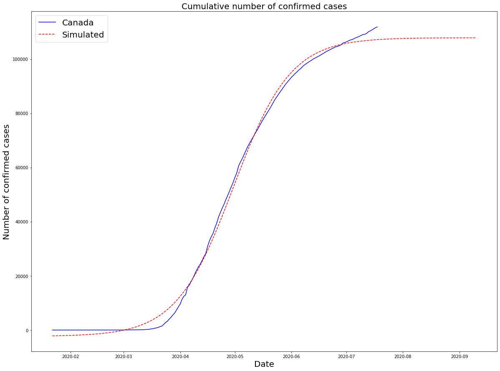
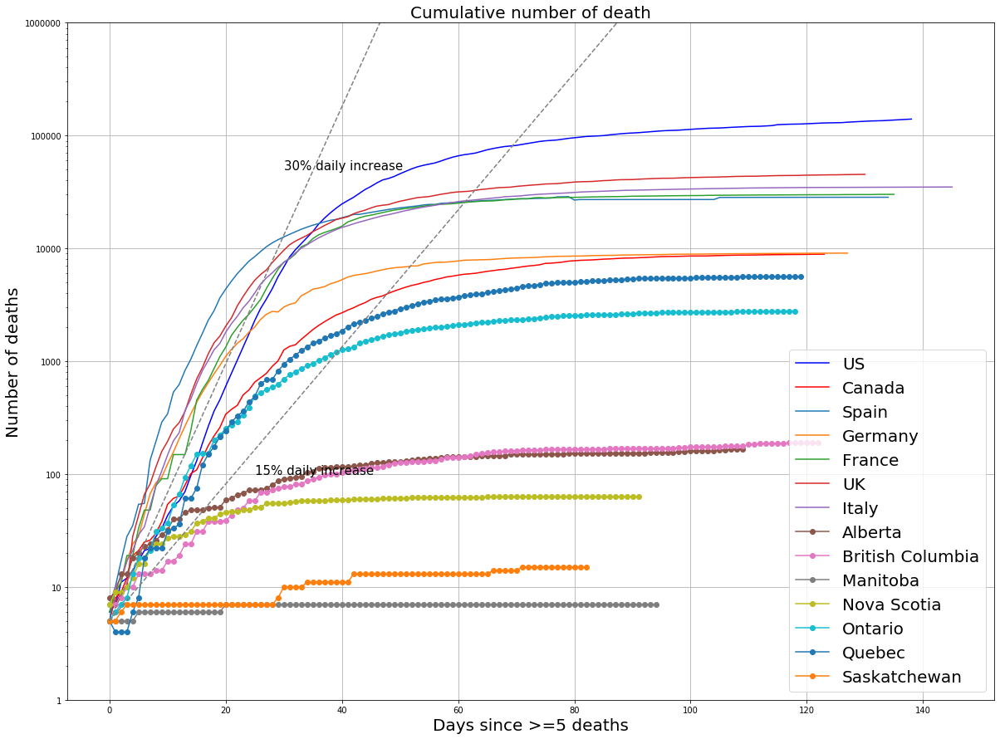

# COVID19
 Analysis on COVID-19 pandemic
updated on April 21, 2020  

# Predictions on growth of confirmed Novel Coronavirus (2019-nCoV) cases in countries 

## Goal: Make an educated guess on when the spread of the novel coronavirus will stabilize (i.e. when the things will get better) in different countries

## Method: 
1. Use the data from China as an example to create logistic models for different countries 
2. Use R^2 to evaluate goodness of fit
3. Use inflection point to predict the turning point (i.e. when the number of newly confirmed cases per day will start to decrease)
4. Use 99.9% of the top horizontal asymptote value to predict when the situation wil stablize (i.e. the number of newly confirmed cases is closed to zero)

## Data: 
Publically available source from 2019 Novel Coronavirus COVID-19 (2019-nCoV) Data Repository by Johns Hopkins CSSE  
https://github.com/CSSEGISandData/COVID-19/blob/master/csse_covid_19_data/csse_covid_19_time_series/time_series_19-covid-Confirmed.csv

## Disclaimer: 
### 1. The model assumes that everything stays constant, so the conclusions will be affected both positively and negatively by dramatic changes such as new travel restictions, shortage of health care supplies, ect
### 2. Only confirmed cases were included, so the result depends number of tests done and it does not necessarily reflect the actual infected population in each countries
### 3. I intend to update every week and conclusion may be different in each update (due to new models being generated from latest data)

## Summary: 
### 0. Update on the parameter boundary  for model
### 1. The logistic model was applied to 102 countries
### 2. Mean turning point for these countries is on 2020-04-07 
(This is an understimate because only countries close to turning points can be modeled)
### 3. Mean CurveTop for these countries is on 2020-05-24
(This is also an understimate. If you check the graphs in the bottom, you will find that the numbers in some countires did not decrease as models predict )
### 4. The numbers of confirmed cases in some countires (such as  US, Italy, Spain, Canada) did not drop as predicted 
### 5. Comparing to last week, more countries can be modeled by logistic model. Russia, Turkey, and Iran are prediced to exceed 8 milion cases 
### 6. From example graphs, there is no indication that the rate of increasing will drop soon as model prediction. 
It could be due to increased number of tests done but it also proves that the models tend to underestimate the situation.
### 7. The earliset time for situation in most countries to be stablized is in the begining of June 

# Predictions on growth of reported death by Novel Coronavirus (2019-nCoV)

## Goal: Compare deaths within Canada with other countries.

## Method: 
### Draw logtithmic graph similar to slide 6 of Ontario's projections released on April 3, 2020
(URL: https://www.cbc.ca/news/canada/toronto/ontario-covid-projections-1.5519575)

## Data: 
Publically available source from 2019 Novel Coronavirus COVID-19 (2019-nCoV) Data Repository by Johns Hopkins CSSE  
https://github.com/CSSEGISandData/COVID-19/blob/master/csse_covid_19_data/csse_covid_19_time_series

## Notes: 
### This is NOT official projection.
### This notebook can be used for other provinces or countries by changing names in the code.

## Summary: 
### 1. The number of death in US exceeded most affected European countries (e.g. France, Italy, Germany, UK, Spain) while the number in Canada remained relatively lower. But unlike other countires, Canada did not show an obvious decrease in the rate.
### 2.Within Canada, the death rate is slowing down only in Alberta and BC.
### 3. In summary, the death rate is unlikely to drop yet in Canada, specifically in Ontario and Quebec.

